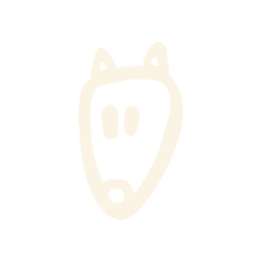

*If you don't like the fruits you are growing, change the seed™*

Building Africa's sovereign digital infrastructure from Pretoria: 
every portal, sector, terminal and brand in one OmniGrid™.

`Launch readiness 77/77` · `30 sectors` · `225 pages` · `80 public repos`

## 🎂 Happy 39th, Sam

Today Samantha Ford Schoeman, the hand behind every Sam Fox™ creature, turns 39.
Her birthday page shows 34 of her pieces: the originals, the Banimal™ prints, the nursery walls and the patterns.

[Open Sam's birthday page](https://fruitful.faa.zone/celebrate/sam-39/) · [See it in the repo](https://github.com/heyns1000/fruitful/tree/main/celebrate/sam-39)

## 🌍 The ecosystem

| Part | What it is | Where |
|---|---|---|
| **Fruitful™** | The Global Ecosystem launch site and OmniGrid™ | [fruitful](https://github.com/heyns1000/fruitful) |
| **FAA.ZONE™** | Baobab Security Network™ terminal | [baobab](https://github.com/heyns1000/baobab) |
| **Seedwave™** | One site per sector: wildlife, trade, justice, nutrition and more | `*.seedwave.faa.zone` |
| **Fruitful API Platform** | The shared API behind the portals | [fruitful-api-platform](https://github.com/heyns1000/fruitful-api-platform) |
| **Banimal™ · Sam Fox™** | Brand source of truth (Banimal Connector) | private |

## 📈 This year

| 3,438 | 80 | 30 | 161 |
|:---:|:---:|:---:|:---:|
| contributions | public repos | sectors live in the grid | applications |

## 🚧 Building now

- **Ecosystem launch**: the Global Ecosystem page, 77 of 77 routes ready
- **The Shock Launch**: the welcome page in English, 中文 and Español
- **Banimal Connector**: one verified set of brand marks pulled into every site

> "It always seems impossible until it is done." Nelson Mandela
>
> Between two baobabs stands the philosophy of Fruitful™: Ubuntu, growth and transformation.

Fruitful Holdings (Pty) Ltd · Pretoria, South Africa · Brand marks via the Banimal Connector&nbsp;

Earlier versions of this profile: [ARCHIVE-20261005.md](ARCHIVE-20261005.md) · [ARCHIVE-20260106.md](ARCHIVE-20260106.md)
